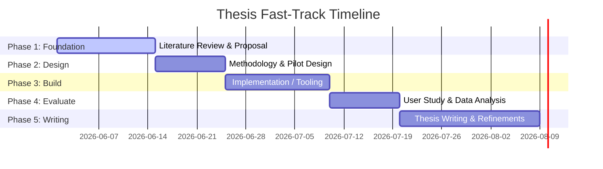

# 🎓 Thesis Completion Dashboard & Checklist

Welcome to your thesis workspace! This interactive checklist is designed to help you organize your workflow, maintain momentum, and complete your thesis as efficiently as possible.

Based on the reference papers in your repository, your thesis lies at the intersection of **Data Glyphs, Visual/Icon Complexity, and Perception/Design Guidelines**.

---

## ⚡ Fast-Track Strategy (How to Finish Quickly)
1. **Scope Narrowly:** Focus on one clear research question (e.g., "Does contour styling improve star glyph readability under noise?" or "Does automated visual complexity predict user search time for custom glyphs?"). Do not try to solve everything.
2. **Reuse Existing Tools:** If measuring visual complexity, adapt Forsythe's or Garcia's metrics using existing Python libraries (e.g., OpenCV, skimage) rather than building pixel-analysis algorithms from scratch.
3. **Draft Iteratively:** Write the methodology and literature review *while* building or running your study. Do not wait until the end to start writing.

---

## 📅 Roadmap & Milestones

---

## 📋 Comprehensive Checklist

### 🔍 Phase 1: Literature Review & Problem Definition
- [ ] **Read and summarize the core repository papers:**
  - [ ] *A Systematic Review of Experimental Studies on Data Glyphs* (Establish the landscape and common experimental designs).
  - [ ] *Glyph-based Visualization Foundations, Design Guidelines...* (Learn design taxonomies).
  - [ ] *The Influence of Contour on Similarity Perception of Star Glyphs* (Understand how visual attributes like contours affect search/similarity tasks).
  - [ ] *Forsythe - Measuring Icon Complexity Automated* & *Garcia - Development/Validation of Icons Abstractness* (Understand visual complexity metrics: edge count, compression ratio, perimeter-to-area ratio, etc.).
  - [ ] *Glyph Visualization: A Fail-Safe Design Scheme Based on Quasi-Hamming Distances* (Analyze mathematical error correction/optimization in glyph spacing).
  - [ ] *Taxonomy-Based Glyph Design with a Case Study...* (Domain-specific glyph application workflow).
- [ ] **Define your exact thesis question & contribution:**
  - *Goal:* Write a 1-page summary specifying what you are testing, measuring, or building, and get supervisor sign-off.
- [ ] **Draft Chapter 1 (Introduction) & Chapter 2 (Literature Review):**
  - *Tip:* Use references directly from the papers' bibliographies to trace relevant work.

### 📐 Phase 2: Methodology & Design
- [ ] **Design the core artifact or experiment:**
  - [ ] If building a tool: Map out the system architecture (e.g., Python/JavaScript pipeline to compute complexity metrics).
  - [ ] If running an experiment: Define independent variables (e.g., glyph contour, complexity level) and dependent variables (e.g., response time, error rate).
- [ ] **Write a study protocol / pilot test plan:**
  - Run a quick pilot test with 1-2 peers to catch software bugs or confusing instructions before launching the main study.

### 💻 Phase 3: Implementation & Development
- [ ] **Set up development environment in this repository:**
  - Create `/src` for code, `/data` for datasets, and `/docs` for draft chapters.
- [ ] **Build the prototype / metrics calculator / stimulus generator:**
  - Focus on a Minimum Viable Product (MVP) that outputs clean data (e.g., CSV with participant responses or computed complexity scores).
- [ ] **Automate data logging:**
  - Ensure all experimental runs or metric computations are automatically saved to file to prevent manual data-entry errors.

### 📊 Phase 4: Evaluation & Analysis
- [ ] **Collect data:**
  - Recruit participants or run the automated pipeline across your dataset.
- [ ] **Perform statistical analysis:**
  - Use Python (Pandas/SciPy) or R to run basic significance tests (e.g., t-test, ANOVA) to check if your hypothesis holds.
- [ ] **Create visualizations:**
  - Generate clean plots (box plots, scatter plots) for your results section.

### ✍️ Phase 5: Writing & Finalization
- [ ] **Draft the remaining chapters:**
  - [ ] Chapter 3: Methodology (Describe the software/experimental setup).
  - [ ] Chapter 4: Results (Present data and visualizations).
  - [ ] Chapter 5: Discussion & Future Work (Interpret what the results mean).
  - [ ] Chapter 6: Conclusion.
- [ ] **Self-Edit & Format:**
  - Verify citation formatting (e.g., APA/IEEE).
  - Double-check figure numbers, table numbers, and appendix references.
- [ ] **Submit to supervisor for final review.**
