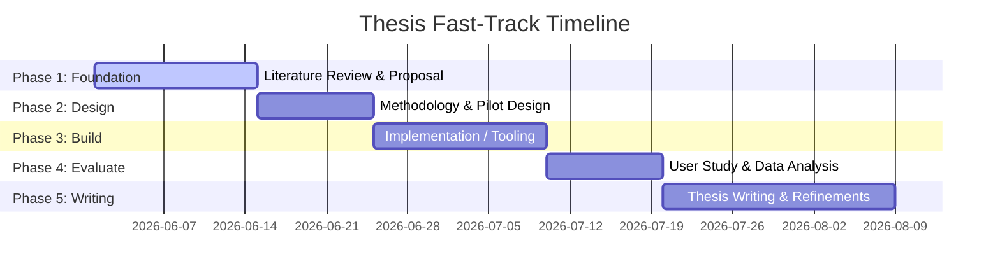

# 🎓 Thesis Completion Dashboard & Checklist

Welcome to your thesis workspace! This interactive checklist is designed to help you organize your workflow, maintain momentum, and complete your thesis as efficiently as possible.

Based on the reference papers in this repository, the thesis is about **how humans identify and perceive icons/glyphs, how those visual factors can be organized into computer-measurable feature families, and how human-study scores compare with computer-derived visual feature scores**.

Working thesis statement:

> This thesis investigates how visual factors identified in glyph/icon perception literature can be organized into computer-measurable feature families, and compares those computational feature scores with human identification/perception scores to determine which visual factors influence agreement, mismatch, distinguishability, and confusability between humans and computer-based glyph analysis.

Scope boundary:

- Use visual features that can be computed from the glyph image.
- Keep semantic meaning, historical/cultural knowledge, familiarity, metaphor, and learnability outside the active computer-vision feature families.
- Treat metadata as context or a study/control variable, not as computer-based semantic understanding.

---

## ⚡ Fast-Track Strategy (How to Finish Quickly)
1. **Scope Narrowly:** Focus on comparing literature-derived visual feature families with human identification/perception scores for the same glyph/icon stimuli.
2. **Reuse Existing Tools:** Use the existing feature extraction, dashboard, and similarity pipeline as the computer-measurement side of the study.
3. **Keep The Boundary Clear:** Do not treat semantic meaning, familiarity, or historical/cultural interpretation as computer-vision features.
4. **Draft Iteratively:** Write the methodology and literature review while refining the feature families and study protocol.

---

## 📅 Roadmap & Milestones

```mermaid
gantt
    title Thesis Fast-Track Timeline
    dateFormat  YYYY-MM-DD
    section Phase 1: Foundation
    Literature Review & Proposal   :active, 2026-06-01, 14d
    section Phase 2: Design
    Methodology & Pilot Design     : 2026-06-15, 10d
    section Phase 3: Build
    Implementation / Tooling       : 2026-06-25, 15d
    section Phase 4: Evaluate
    User Study & Data Analysis     : 2026-07-10, 10d
    section Phase 5: Writing
    Thesis Writing & Refinements   : 2026-07-20, 20d
```

---

## 📋 Comprehensive Checklist

### 🔍 Phase 1: Literature Review & Problem Definition
- [ ] **Read and summarize the core repository papers:**
  - [ ] *A Systematic Review of Experimental Studies on Data Glyphs* (Establish the landscape and common experimental designs).
  - [ ] *Glyph-based Visualization Foundations, Design Guidelines...* (Learn design taxonomies).
  - [ ] *The Influence of Contour on Similarity Perception of Star Glyphs* (Understand how visual attributes like contours affect search/similarity tasks).
  - [ ] *Forsythe - Measuring Icon Complexity Automated* & *Garcia - Development/Validation of Icons Abstractness* (Understand visual complexity metrics: edge count, compression ratio, perimeter-to-area ratio, etc.).
  - [ ] *Glyph Visualization: A Fail-Safe Design Scheme Based on Quasi-Hamming Distances* (Analyze mathematical error correction/optimization in glyph spacing).
  - [ ] *Taxonomy-Based Glyph Design with a Case Study...* (Domain-specific glyph application workflow).
- [ ] **Define your exact thesis question & contribution:**
  - *Goal:* Write a 1-page summary explaining the literature-derived visual feature families, the computer-measured scores, the human-study scores, and the comparison method.
- [ ] **Draft Chapter 1 (Introduction) & Chapter 2 (Literature Review):**
  - *Tip:* Use references directly from the papers' bibliographies to trace relevant work.

### 📐 Phase 2: Methodology & Design
- [ ] **Define the active visual feature families:**
  - [ ] Complexity.
  - [ ] Shape/silhouette.
  - [ ] Stroke/structure.
  - [ ] Density/fill.
  - [ ] Balance/layout.
  - [ ] Color/contrast.
  - [ ] Texture.
- [ ] **Design the human study:**
  - [ ] Select glyph/icon stimuli from the local datasets.
  - [ ] Decide what human scores will be recorded, such as identification accuracy, confidence, perceived similarity, perceived complexity, or confusability.
  - [ ] Ensure the same stimuli have computer-derived visual feature-family scores.
- [ ] **Write a study protocol / pilot test plan:**
  - Run a quick pilot test with 1-2 peers to catch confusing instructions, ambiguous stimuli, and data-logging issues before launching the main study.

### 💻 Phase 3: Implementation & Development
- [ ] **Set up development environment in this repository:**
  - Create `/src` for code, `/data` for datasets, and `/docs` for draft chapters.
- [ ] **Build the prototype / metrics calculator / stimulus generator:**
  - Focus on a Minimum Viable Product (MVP) that outputs clean data: participant responses and the matching computer-derived visual feature-family scores.
- [ ] **Automate data logging:**
  - Ensure all experimental runs or metric computations are automatically saved to file to prevent manual data-entry errors.

### 📊 Phase 4: Evaluation & Analysis
- [ ] **Collect data:**
  - Recruit participants and record human identification/perception scores for the selected glyph/icon stimuli.
- [ ] **Perform statistical analysis:**
  - Compare human scores with computer-derived feature-family scores using correlations, regression, agreement/mismatch analysis, or cluster/nearest-neighbor comparisons.
- [ ] **Create visualizations:**
  - Generate plots showing which visual feature families align with or diverge from human identification/perception.

### ✍️ Phase 5: Writing & Finalization
- [ ] **Draft the remaining chapters:**
  - [ ] Chapter 3: Methodology (Describe the software/experimental setup).
  - [ ] Chapter 4: Results (Present data and visualizations).
  - [ ] Chapter 5: Discussion & Future Work (Interpret what the results mean).
  - [ ] Chapter 6: Conclusion.
- [ ] **Self-Edit & Format:**
  - Verify citation formatting (e.g., APA/IEEE).
  - Double-check figure numbers, table numbers, and appendix references.
- [ ] **Submit to supervisor for final review.**
