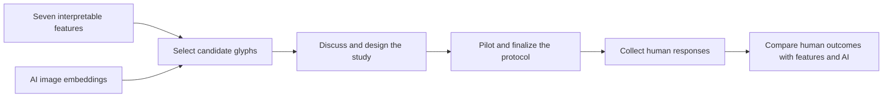

# Current State and User-Study Plan

## Status of This Document

This is a **working plan**, not a finalized user-study protocol. The task, stimuli, display sizes, participant criteria, measurements, sample size, and analysis thresholds still need to be discussed and approved.

The immediate next step is **glyph selection**. Study design begins after a candidate glyph set has been reviewed.

## Current State

The computer-side preparation currently provides:

- a normalized corpus of 28,749 icons from 13 source sets;
- seven finalized visual feature families with one dashboard representative per family;
- feature-value inspection and balanced feature sampling;
- feature-based clustering and similarity exploration;
- AI image-embedding clustering over the same glyph sample;
- lasso selection, per-icon inspection, cluster summaries, heatmaps, and stable icon IDs;
- a feature-versus-AI comparison with pairwise same-cluster agreement.

No participant protocol, response dataset, or human-computer result currently exists.

## Bigger Picture

The dashboard and AI components support stimulus selection and later interpretation. They do not establish human discernibility by themselves.

## Role of the AI Component

The project currently produces two computer-side representations of the same glyphs.

### Feature-Based Representation

Feature clustering uses the seven interpretable visual measurements:

1. complexity;
2. shape/enclosure;
3. stroke/structure orientation;
4. density/fill;
5. balance/symmetry;
6. color/saturation;
7. texture variation.

This representation is understandable: differences between glyphs can be discussed in terms of particular visual properties.

### AI Representation

AI clustering sends normalized glyph pixels to an image-embedding model. The model returns high-dimensional vectors, which are clustered independently of the seven feature values.

The AI does not receive feature values, labels, semantic metadata, or participant responses. It is a second computer-generated view of visual similarity, not a human participant or ground truth.

### How the Two Representations Support Selection

| Computer-side case | Working interpretation | Possible selection role |
|---|---|---|
| Feature and AI representations both place glyphs close | Both describe the glyphs as visually similar | Potentially difficult/confusable candidates |
| Both place glyphs far apart | Both describe the glyphs as visually different | Easy or control candidates |
| Feature-close but AI-far | The seven measurements may omit a visual distinction detected by the embedding | Diagnostic disagreement candidates |
| Feature-far but AI-close | The embedding sees similarity despite measured feature differences | Diagnostic disagreement candidates |

Current pairwise agreement compares feature and AI cluster assignments only. It is not human agreement and does not show which representation is correct.

## Study-Design Decision

Before implementing the study, define what **discernible** means in this thesis.

### Option A: Visual Matching — Recommended Primary Direction

Show a reduced target glyph and ask the participant to select the matching glyph from several clearly rendered alternatives.

This can measure:

- matching accuracy at each size;
- which glyphs are confused;
- how performance changes with size;
- a future per-glyph, per-pair, or per-set discernibility threshold.

This direction tests appearance without requiring participants to know the glyph's name or meaning.

### Option B: Pairwise Discrimination

Show glyph pairs and ask whether they are the same/different, or which candidate matches a reference.

This can measure pairwise confusability and maps directly to feature and AI distances. It is narrower than testing recognition across a whole glyph set.

### Option C: Semantic Identification

Show a glyph and ask participants to identify its meaning or select a label.

This measures recognizability, but familiarity, culture, metaphor, and prior experience become important confounds. It should be selected only if semantic identification is part of the intended research question.

### Provisional Recommendation

Use visual matching as the primary task. If the scope permits, use a small secondary pairwise task for selected feature-versus-AI disagreement cases.

This recommendation must be discussed with the supervisor before it becomes the study protocol.

## Glyph-Selection Plan

### Selection Principles

- Prefer matched glyphs from the same source set and visual style.
- Avoid allowing dataset, color treatment, or rendering style to explain the condition unintentionally.
- Include close and distant controls.
- Include feature-versus-AI disagreement cases.
- Cover variation across the seven feature families.
- Use only glyphs with valid measurements and acceptable foreground masks.
- Preserve stable `icon_id` values for every selected stimulus.

### Dashboard Workflow

1. Inspect each of the seven Feature Groups.
2. Review low, middle, and high representative values.
3. Open Image Clustering and inspect clusters and heatmaps.
4. Use cluster summaries to understand the dominant measured properties.
5. Use lasso selection to inspect visually close candidate groups.
6. Open AI Clustering for the same sample.
7. Compare feature and AI groupings.
8. Mark agreed-close, agreed-far, and disagreement candidates.
9. Review candidates for source/style consistency.
10. Export and freeze a small pilot candidate set.

A possible first pilot pool is approximately 24–36 glyphs. This range is only for keeping the prototype manageable; it is not a finalized sample-size decision.

## Provisional Trial Structure

A possible visual-matching trial could:

1. present a target glyph at a controlled reduced size;
2. present several larger matching alternatives;
3. ask the participant to select the matching glyph;
4. record the selected glyph and correctness;
5. optionally record response time and confidence.

The exact exposure duration, number of alternatives, display sizes, repetition count, randomization, and feedback policy remain open design decisions.

## Possible Response Record

One response row could contain:

| Field | Purpose |
|---|---|
| `participant_id` | Pseudonymous participant identifier |
| `trial_id` | Unique randomized trial identifier |
| `target_icon_id` | Stable ID of the reduced target glyph |
| `chosen_icon_id` | Stable ID selected by the participant |
| `size_px` | Rendered target size |
| `correct` | Whether the selected glyph matches the target |
| `response_time_ms` | Optional response latency |
| `confidence` | Optional confidence response |

Stable icon IDs will allow responses to join with:

- the seven feature values;
- pairwise feature-family distances;
- feature-cluster assignments;
- AI embedding distances;
- AI-cluster assignments.

## What the Results Could Look Like

### Primary Human Results

- **Accuracy-by-size curves:** performance as glyph size decreases.
- **Confusion matrices:** which glyphs are mistaken for one another at each size.
- **Per-glyph or per-set summaries:** easier and harder glyphs across conditions.
- **Discernibility thresholds:** the smallest size meeting a predefined performance rule, if a suitable rule is approved.

### Human-Computer Comparison

- association between human confusion and seven-feature distance;
- association between human confusion and AI embedding distance;
- comparison of whether features, AI, or both predict difficult pairs;
- cases where humans follow the interpretable features;
- cases where humans align more closely with the AI representation;
- mismatch cases unexplained by either computer representation.

### Example Form of a Future Finding

> Matching performance decreased as glyph size was reduced. Glyph pairs with smaller differences in particular visual families were confused more often. AI embedding distance explained additional confusion for some pairs, while other errors were not explained by either computer representation.

This illustrates the form of a possible result. It is not a prediction or current finding.

## Recommended Sequence

1. Agree with the supervisor on the meaning of discernibility.
2. Decide whether visual matching, pair discrimination, semantic identification, or a limited combination best answers the research question.
3. Select candidate glyphs using feature values, clustering, lasso inspection, cluster summaries, and AI disagreements.
4. Export the candidate stimuli and their computer-side measurements.
5. Review and freeze a small pilot stimulus set.
6. Prototype the trial interface.
7. Run a small usability pilot to identify unclear instructions, unusable sizes, and excessive trial length.
8. Finalize the protocol, conditions, exclusion rules, response schema, and statistical analysis plan.
9. Obtain the required institutional approval and consent materials.
10. Collect the main participant dataset.
11. Join human responses to feature and AI measurements.
12. Report size effects, confusions, agreement, mismatch, and uncertainty.

## Questions for the Next Supervisor Discussion

1. Does **discernible** mean visual matching, pairwise discrimination, semantic identification, or a combination?
2. Should participants be ordinary/non-expert users?
3. Should glyphs be compared only within the same source set?
4. Is the primary result per glyph, per pair, per set, or all three?
5. Should response time and confidence be secondary measures or omitted?
6. Should the study include a qualitative explanation component after selected trials?
7. What performance criterion should define a discernibility threshold?
8. What institutional approval and data-protection steps are required before recruitment?

## Current Boundaries

- Do not call feature or AI clusters human perceptual groups.
- Do not treat pairwise feature-versus-AI agreement as correctness.
- Do not call post-hoc seven-feature descriptions of AI clusters model attribution.
- Do not finalize pixel sizes before piloting the task and display setup.
- Do not calculate a participant count without a finalized design and power rationale.
- Do not collect participant data before the required approval, consent, and privacy procedures are in place.

## Related Repository Documentation

- [Thesis overview](../wiki/thesis-overview.md)
- [Evaluation and human study](../wiki/evaluation-and-human-study.md)
- [Dashboard UI](../wiki/dashboard-ui.md)
- [Dashboard implementation](../wiki/dashboard-implementation.md)
- [Literature and evidence](../wiki/literature-and-evidence.md)
- [Limitations and backlog](../wiki/limitations-and-backlog.md)

