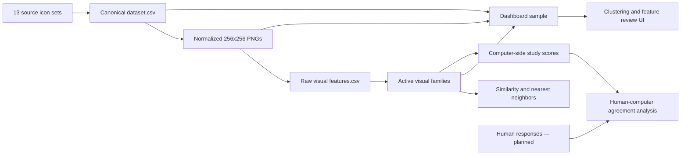

# Thesis Repository Wiki

This wiki is the organized knowledge base for people and AI agents working in this repository. It explains the research boundary, data, processing pipeline, visual features, analysis outputs, dashboard, literature evidence, evaluation plan, and safe working practices.

The wiki explains the system; it does not replace generated metadata or executable code as the source of truth. When a dated count or behavior disagrees with a current generated artifact or script, verify the artifact or script and update the wiki.

## Start Here

| Need | Page |
|---|---|
| Understand the thesis and its boundaries | [Thesis overview](thesis-overview.md) |
| Find a directory, script, input, or output | [Repository architecture](repository-architecture.md) |
| Understand the 13 icon collections and canonical CSV | [Datasets and provenance](datasets-and-provenance.md) |
| Follow data from source icons to analysis artifacts | [End-to-end pipeline](pipeline.md) |
| Understand extraction and all active visual families | [Feature system](feature-system.md) |
| Review the visual audit of all seven representatives across B/W, Red, and Colored icons | [Feature-family visual audit](../audit%20families.md) |
| Understand distance, nearest neighbors, PCA, and clustering | [Similarity and clustering](similarity-and-clustering.md) |
| Use or test every dashboard view | [Dashboard UI](dashboard-ui.md) |
| Change dashboard generation or its JSON/CSV contract | [Dashboard implementation](dashboard-implementation.md) |
| Trace claims to the local papers and research notes | [Literature and evidence](literature-and-evidence.md) |
| Understand the planned human study and comparison | [Evaluation and human study](evaluation-and-human-study.md) |
| Find runnable commands and script parameters | [Commands and scripts](commands-and-scripts.md) |
| Know which files are generated and by what | [Artifacts and data contracts](artifacts-and-data-contracts.md) |
| Work safely as an AI agent or contributor | [Agent and contributor guide](agent-and-contributor-guide.md) |
| Diagnose failures and verify changes | [Verification and troubleshooting](verification-and-troubleshooting.md) |
| See known gaps and planned work | [Limitations and backlog](limitations-and-backlog.md) |
| Review the staged feature/dashboard architecture plan | [Review, feature pipeline, and dashboard refactoring plan](../tasks/review-feature-dashboard-refactoring-plan.md) |
| Decode project terminology | [Glossary](glossary.md) |
| Maintain this wiki | [Wiki maintenance](wiki-maintenance.md) |

## System at a Glance

## Current Snapshot

Verified on **2026-07-27** from the current CSV and JSON artifacts:

| Item | Current value |
|---|---:|
| Icon sets | 13 |
| Canonical dataset rows | 28,749 |
| Normalized image size | 256 × 256 PNG |
| Feature-corpus rows | 28,749 |
| Feature CSV columns | 133 total: 23 metadata + 110 raw numeric features (schema v2) |
| Active visual features | 81 |
| Active visual families | 7 |
| Feature Groups representatives | 7 configured defaults, one per family; browser-session overrides synchronize Clustering |
| Complexity representative | Canny edge density; grayscale quadtree remains an active secondary feature |
| Feature Values features | The 7 configured Feature Groups representatives |
| Feature-v2 release gate | Blocked pending completion of the frozen two-rater benchmark |
| Feature Groups pilot sample | Defaults: 10 dataset-balanced icons per family from 28,128 certain-mask rows; exploratory overrides use the 129-row clustering sample |
| Feature Groups comparison | Exactly 3 selected sample icons; all 7 representative values in a separate fullscreen modal |
| Dashboard rows | 129 |
| Dashboard sampling | Up to 10 random icons per set, seed 42 |
| Dashboard variants | Image, metadata, combined |
| Dashboard cluster values | 3, 5, 7, 10 |
| Human-response dataset | Not implemented yet |

Recheck these values with the recipes in [Verification and troubleshooting](verification-and-troubleshooting.md) before making current-state claims.

## Source-of-Truth Order

Use the most direct evidence available:

1. Current executable scripts for behavior and generation rules.
2. Generated JSON/CSV reports for the state of the last completed run.
3. `THESIS_STATUS.md` and `tasks/current-thesis-next-steps.md` for project direction and progress.
4. `icon_data/MANIFEST.md` for source collection provenance.
5. This wiki for organized explanation and routing.
6. Older notes and historical plans for context only.

AI agents must begin with `AGENTS.md`, which makes wiki review and maintenance a completion requirement. Other important entry points include `agent.md`, `code/build_icon_dataset.py`, `code/extract_icon_features.py`, `code/compute_icon_similarity.py`, `code/build_analysis_dashboard.py`, `icon_data/analysis/features_metadata.json`, and `icon_data/analysis/analysis_dashboard/dashboard_data.json`.

## Core Research Boundary

The computer side measures visible properties of glyph images: complexity, shape/silhouette, stroke/structure, density/fill, balance/layout, color/contrast, and texture. Semantic meaning, familiarity, metaphor, cultural knowledge, and learnability are not image-derived visual feature families. They may be metadata, controls, prompts, or human-study outcomes.

Clustering, PCA, and nearest-neighbor results are diagnostic tools. They support the eventual human-computer comparison; they are not the thesis contribution by themselves.
