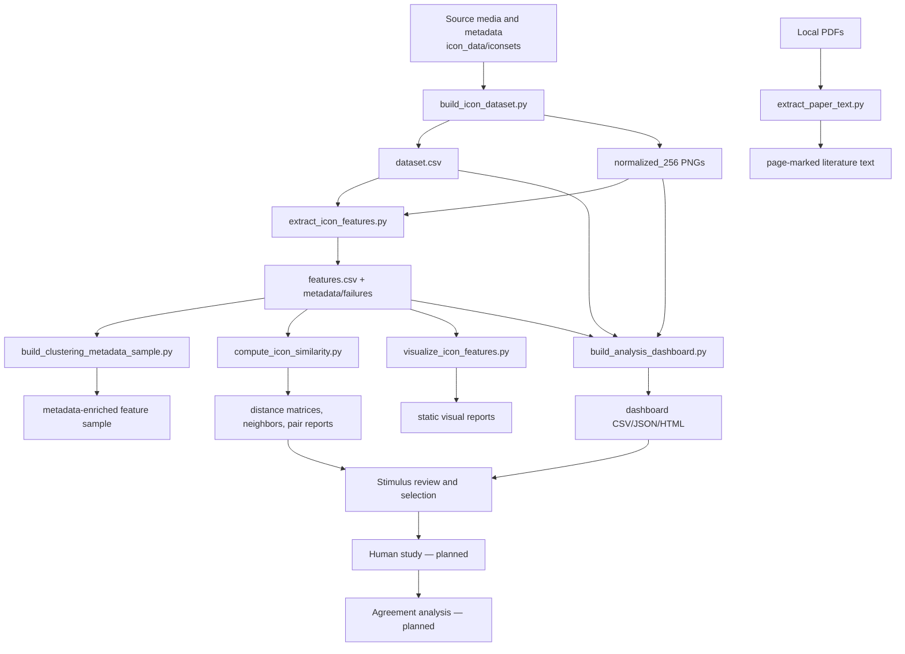

# End-to-End Pipeline

## Schema-v2 extraction and release gate

The feature stage now performs robust alpha/opaque-border foreground extraction, writes mask diagnostics per icon, computes ten versioned v2 channels, and preserves schema-v1 columns. Run a small `--per-set-limit` extraction first, inspect uncertain masks and extremes, then run the complete corpus. After extraction, build the frozen rating sheet and overlays with `code/evaluation/build_feature_v2_benchmark.py`; evaluate completed two-rater judgments with `code/evaluation/evaluate_feature_v2_benchmark.py`. A missing or failed rating gate keeps the pilot disabled even when engineering generation succeeds.

[Wiki home](README.md) · [Feature system](feature-system.md) · [Commands](commands-and-scripts.md)

## Data Lineage



## Stage 1: Acquire and Preserve Sources

Source collections live in `icon_data/iconsets/`. Some are downloaded repositories, some use APIs or Wikimedia, some are extracted from PDFs, and Blissymbolics is rendered locally. Dataset-specific download scripts exist under `code/`, but source folders should not be casually refreshed because upstream versions, licenses, and row identities can change.

Before changing sources, read `icon_data/MANIFEST.md` and the dataset's own README or source note.

## Stage 2: Build the Canonical Table

```powershell
python code/build_icon_dataset.py
```

The command scans source media, applies per-dataset canonical rules, enriches supported metadata, and rewrites `icon_data/analysis/dataset.csv`.

Canonical JSON/CSV metadata and `dataset.csv` are read and written explicitly as UTF-8, and repository-relative paths are serialized with POSIX `/` separators before hashing. These rules keep stable `icon_id` values reproducible on Windows as well as macOS/Linux. For a full-corpus restoration, compare freshly scanned `(icon_id, relative_path, normalized_path)` tuples with the preserved manifest before accepting a rewrite.

To also normalize images:

```powershell
python code/build_icon_dataset.py --normalize --workers 8
```

Use `--limit N` only for a normalization smoke test. Use `--force` only when the exact normalized targets are intended to be regenerated.

## Stage 3: Extract Visual Features

```powershell
python code/extract_icon_features.py --workers 12 --executor process
```

The extractor reads canonical rows and normalized PNGs, adds metadata/identity annotations, and writes the complete feature corpus to:

- `icon_data/analysis/features.csv`
- `icon_data/analysis/features_metadata.json`
- `icon_data/analysis/feature_failures.json`

Missing images and unexpected per-icon extraction exceptions are recorded in `feature_failures.json`; one malformed icon does not abort the remaining corpus. A complete run is accepted only when `selected_row_count` equals the canonical row count and feature rows plus failures account for every selected row.

Feature extraction defaults to a process pool because the feature registry is CPU-bound and Python threads underuse multicore machines at full-corpus scale. `features_metadata.json` records the executor and worker count; use `--executor thread` only as a compatibility fallback.

Stroke-width distance transforms add an explicit background border before measurement. This prevents infinite values when an icon's inferred foreground occupies the entire 256×256 canvas.

The verified schema-v2 output has 28,749 rows, 23 metadata columns, and 110 raw numeric image-feature columns, with zero failures and no missing/non-finite numeric cells. Only 81 numeric features participate in the active literature-mapped family system.

## Stage 4: Enrich Context Metadata

```powershell
python code/build_clustering_metadata_sample.py
```

This joins canonical rows, feature rows, inferred style labels, metadata tokens, and McDougall ratings. It writes `clustering_metadata_sample.csv` and a missing-data report. These fields provide context and exploratory variants; they are not image-derived visual perception measurements.

## Stage 5: Compute Similarity

```powershell
python code/compute_icon_similarity.py
```

This stage transforms circular features, robust-scales numeric channels, applies feature/family reliability weights, and computes Euclidean and cosine distances. It emits pairwise matrices, nearest neighbors, closest pairs, visual sheets, an HTML report, and `similarity_metadata.json`.

See [Similarity and clustering](similarity-and-clustering.md) for the math and interpretation boundary.

## Stage 6: Build Static Feature Visualizations

```powershell
python code/visualize_icon_features.py
```

When Matplotlib is available, the output can include distributions by set, a Spearman correlation heatmap, PCA, contact sheets, and feature extremes. Without Matplotlib, the script writes a summary-only report. The interactive dashboard is currently the stronger exploration interface.

## Stage 7: Build the Dashboard

```powershell
python code/build_analysis_dashboard.py
```

The dashboard builder performs its own deterministic random sampling from `dataset.csv`, extracts current features for those rows, creates image/metadata/combined matrices, computes clustering variants, prepares full-sample feature-review/explorer data from `features.csv`, and regenerates HTML/JSON/CSV outputs.

The dashboard clustering sample is independent from the complete feature corpus: Clustering uses 129 rows, while Feature Groups receives a compact 28,749-row pool and draws independent 20-icon pilot samples in the browser. Feature Values examples and Feature Review statistics also use all 28,749 rows from `features.csv`.

## Stage 8: Serve and Inspect

From the repository root:

```powershell
python -m http.server 8765 --bind 127.0.0.1
```

Open:

```text
http://127.0.0.1:8765/icon_data/analysis/analysis_dashboard/index.html
```

A local HTTP server is required for reliable JSON, JavaScript, and image loading. See [Dashboard UI](dashboard-ui.md) for expected interactions and [Verification and troubleshooting](verification-and-troubleshooting.md) for browser checks.

## Planned Evaluation Stages

The remaining end-to-end path is:

1. Export per-icon family scores and pairwise family distances.
2. Select controlled stimuli using feature coverage and close/distant pairs.
3. Collect participant identification/similarity/confusability responses.
4. Join responses using stable `icon_id` or pair IDs.
5. Analyze correlation, prediction, agreement, and mismatch.

These stages are specified but not yet implemented. Do not present the current dashboard or clusters as a completed human-computer evaluation.

## Reproducibility Rules

- Keep sampling seeds explicit. Dashboard sampling uses seed 42.
- Record row counts and dependency versions in generated metadata.
- Preserve failure reports, including empty lists.
- Treat changes to canonical paths, IDs, column names, family membership, preprocessing, or weights as data-contract changes.
- Regenerate downstream outputs after upstream schema or feature changes.
- Verify generated artifacts before updating current-state documentation.
