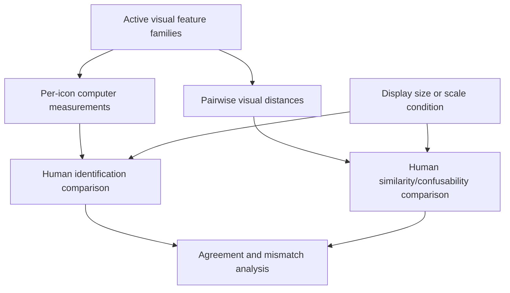

# Thesis Overview

[Wiki home](README.md) · [Literature](literature-and-evidence.md) · [Evaluation](evaluation-and-human-study.md)

## Working Thesis Direction

The project investigates how visual factors identified in icon and glyph perception literature can be organized into computer-measurable feature families, and how those measurements compare with human identification and perception scores for the same stimuli.

The intended comparison has two sides:

1. **Computer side:** values derived from visible pixels, summarized through literature-mapped visual families and pairwise distances.
2. **Human side:** identification, confidence, similarity, confusability, and optionally response-time or scale-robustness measurements.

The final analysis should explain agreement and mismatch: which visible families predict human behavior, where they do not, and what non-visual factors may explain the remaining difference.

## What This Repository Is

This is an empirical and computational thesis workspace. It contains:

- 13 icon/glyph datasets and their provenance;
- a canonical cross-dataset table and normalized images;
- image-feature extraction;
- literature-mapped active visual families;
- similarity, clustering, feature-review, and dashboard tooling;
- literature PDFs, extracted text, and mapping notes;
- a planned evaluation and human-study layer.

It is not primarily a generic icon library, semantic image-understanding system, or clustering demonstration.

## Allowed Computer-Side Claims

The current implementation can support claims about:

- measurable visual structure in normalized icon images;
- interpretable feature families grounded in local literature;
- computer-side similarity, distance, and potential confusability;
- how features and feature families vary across selected stimuli;
- agreement or mismatch with human scores once those scores exist.

The current implementation does **not** prove that the computer understands icon meaning or models perception completely.

## Visual and Non-Visual Boundary

| Visible and computable from pixels | Not a computer-vision family |
|---|---|
| Edge/detail load | Familiarity |
| Shape and silhouette | Meaningfulness |
| Stroke direction and graph structure | Semantic identity |
| Fill, density, and stroke width | Metaphor |
| Symmetry and spatial layout | Cultural or historical convention |
| Color, hue, and contrast | Learnability |
| Tonal texture | Context-dependent interpretation |

Non-visual factors may still be scientifically important. Store them as metadata, collect them from participants, or use them as control variables; do not present them as image-derived feature evidence.

## Analysis Layers

The planned layers are:

- human identification;
- perceived similarity and confusability;
- computer visual features;
- pairwise distinguishability;
- optional scale/display condition;
- human-computer agreement.

See [Evaluation and human study](evaluation-and-human-study.md) for proposed measures and tables.

## Current State

Completed work includes dataset assembly, full-corpus normalization and feature extraction, active-family correction, similarity preprocessing on the earlier pilot, dashboard feature views, literature extraction, and evaluation-layer documentation.

The main missing thesis layer is the human study and the statistical join between participant responses and computer-side scores. Stimulus selection, family-score exports, response schema, and analysis scripts remain in the active backlog.

Authoritative status files:

- `THESIS_STATUS.md`
- `tasks/current-thesis-next-steps.md`
- `tasks/tickets/README.md`
- `code/evaluation/evaluation_layers.md`
